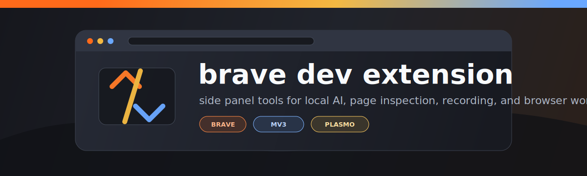
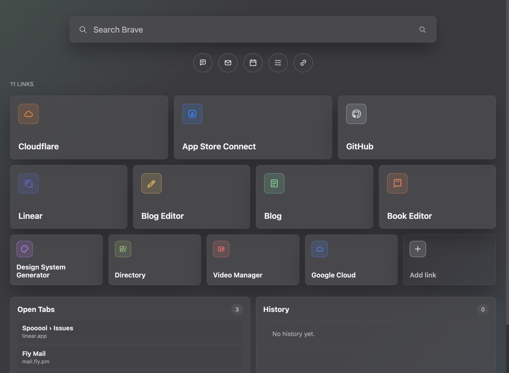

# Brave Dev Extension

[](https://github.com/aloewright/brave-extension/actions/workflows/test.yml)
[](https://www.typescriptlang.org/)
[](https://workers.cloudflare.com/)
[](https://brave.com/)
[](https://buymeacoffee.com/allosaurus)

Brave Dev Extension turns Brave's side panel and new tab page into a compact
developer console. It connects browser context to local AI CLI tools, page
inspection, recording, bookmarks, history, cookies, and synced resource storage.

Built with [Plasmo](https://www.plasmo.com/) for Brave and Chromium browsers.

## Extension Functionality

- **Sidebar rail:** persistent sections for Terminal, Inspector, Extensions,
  Library, Bookmarks, Data, Recorder, Eyedropper, and Settings.
- **Local AI terminal:** native-host backed PTY sessions for CLI tools such as
  Claude Code, Gemini, Copilot, and Codex. Terminal tabs stay alive while moving
  around the sidebar.
- **Page inspection and capture:** scrape the active page, capture selected
  references, crop screenshots, inspect technologies, discover feeds, and send
  selections into the side panel.
- **Cookies and browser data:** inspect site-scoped cookies/cache, use compact
  expand/collapse controls, apply cookie actions, and manage third-party cookie
  prompts without exposing extension data to pages.
- **Recorder:** start browser recording through Brave's native capture prompt,
  pause/resume/stop recordings, keep recent recording metadata, and mirror
  completed clips for MCP access.
- **Bookmarks and history:** pull a local bookmark snapshot into the extension,
  browse bookmarks alphabetically, by favorites, or by category, and show recent
  history on the new tab page.
- **New tab workspace:** Brave Search, ordered app cards for Cloudflare, App
  Store Connect, Email, daily planner, chat, blog editor, link shortener, and
  compact utility links, plus open tabs and scrollable history panels.
- **Resource library:** save links, references, bookmarks, recordings, and PDFs
  as structured resources that can be searched locally or synced through the
  worker backend.
- **Auto picture-in-picture:** detects playable media across tabs and can move
  eligible video into picture-in-picture based on extension settings.

## Architecture

- **Extension UI:** React + TypeScript side panel, popup, content scripts, and
  new tab page packaged by Plasmo as a Manifest V3 extension.
- **Native host:** a Node native-messaging host bridges Brave to local shells,
  the MCP HTTP/SSE server, recorder mirrors, and local config files.
- **Worker backend:** the optional `worker/` service stores conversations,
  links, bookmarks, recordings, PDFs, and vector search metadata using
  Cloudflare Workers infrastructure.
- **Privacy boundary:** web pages talk to content scripts only through explicit
  extension messages. Extension resources, native-host tokens, and stored data
  stay in extension or native-host storage rather than being exposed to sites.

## New tab page



The extension replaces the new tab page with a Brave-style search bar, a row
of icon-only Quick Links (chat / email / calendar / tasks / link shortener),
and a draggable grid of Workspace App tiles.

### Customizing the Quick Links row

The five icon-only links under search are editable on the new tab page.
Click **Edit links** to add, remove, or change each shortcut (name, URL, and
icon). Changes persist in `chrome.storage.local` under `newtab.quickLinks`.

Defaults ship in [`src/newtab-quick-links.ts`](src/newtab-quick-links.ts)
as `DEFAULT_QUICK_LINKS`. To change the out-of-box list for new installs,
edit that array (each entry needs `id`, `label`, `url`, and an `icon` slug
from [`src/newtab-apps.ts`](src/newtab-apps.ts)).

### Customizing the Workspace App grid

The larger tile grid below the Quick Links is sourced from the
`WORKSPACE_APPS` array in [`src/newtab-apps.ts`](src/newtab-apps.ts).
Each tile has `name`, `domain`, `url`, `icon` (one of the named icon
slugs at the top of that file), and an `accent` color. Add, remove, or
re-order entries to change which apps appear; per-tab ordering can also
be rearranged by drag-and-drop and is persisted in
`chrome.storage.local`.

## Development

```sh
pnpm install
pnpm dev            # starts plasmo dev (loads as unpacked extension from build/)
pnpm build          # production build
pnpm install-host   # install the native messaging host
pnpm diagnose-host  # print signing/quarantine state of native artifacts
pnpm typecheck      # tsc --noEmit -p .
pnpm test           # vitest run
pnpm test:coverage  # vitest + v8 coverage (60% line / 50% branch floor)
pnpm test:e2e       # playwright e2e suite
```

### macOS: "Apple could not verify '<random>.node' is free of malware" (ALO-472)

`pnpm install-host` strips `com.apple.quarantine` from every `.node` and
`spawn-helper` under `native-host/node_modules` before the first sidebar
terminal launches. The popup's hash-prefixed filename
(`.9db7f7fe3f8cd7ea-00000000.node`) is XProtect's internal scan-cache
name; the file on disk is one of node-pty's prebuilt
`prebuilds/darwin-{arm64,x64}/pty.node` (plus its `spawn-helper`).

If the popup still appears:

1. Run `pnpm diagnose-host` — confirms which artifacts carry the
   quarantine xattr and what their signing state is.
2. Re-run with `pnpm diagnose-host --fix` to re-scrub.
3. If Gatekeeper has already cached a denial decision, open **System
   Settings → Privacy & Security** and click "Allow Anyway" once. The
   shipped Microsoft prebuilds are ad-hoc signed with stable CDHashes per
   `node-pty` version, so the grant persists across reinstalls.

The installer never re-signs the prebuilds (that would mint a new
CDHash and invalidate any "Allow Anyway" the user has already granted).

## Typechecking

`pnpm typecheck` runs the full TypeScript compiler in `--noEmit` mode against
`tsconfig.json`. The same command runs in the `typecheck` GitHub Actions
workflow on every PR and push to `main` (Node 22, deps installed with
`--ignore-scripts`).

The job is currently **non-blocking** (`continue-on-error: true`) — see
`ROADMAP.md` for the plan to flip it to a hard gate.

## Testing

Unit tests live in `tests/` and run on Vitest with a `happy-dom` environment.
An in-memory `chrome.storage.local` shim is installed in `tests/setup.ts`,
so storage-layer tests run without any browser/extension runtime.
Dependabot opens grouped weekly PRs (Monday 06:00 UTC). Minor/patch
updates auto-merge on green CI via
`.github/workflows/dependabot-auto-merge.yml`; majors are flagged for
human review. Triage SOP: [`docs/dependabot-triage.md`](docs/dependabot-triage.md).

### Storage / migration

Chat history is stored as per-backend shards under
`ai-dev-messages-<backend>` (one of `claude`, `gemini`, `copilot`, `codex`).
Older builds wrote a single `ai-dev-messages` array; the storage layer
migrates that legacy key into shards lazily, idempotently, and without
ever wiping history when the user switches backends mid-migration.

Cold-start reads via `getMessagesForBackend(backend)` issue a single
`chrome.storage.local.get` of the shard key. The legacy key is only
consulted on a second round-trip when the shard is missing _and_ no
`migration:ai-dev-messages:<backend>` marker is set. Once every backend
has been hydrated, the top-level `migration:ai-dev-messages-complete`
flag is set and the legacy key is dropped atomically. Migration markers
also let `getMessages()` and `setMessages()` re-run safely — repeated
calls do not double-shard or lose data
(`tests/migration.ai-dev-messages.test.ts`).

```sh
npm test          # one-shot run
npm run test:watch
```

The `tests` GitHub Actions workflow (`.github/workflows/test.yml`) runs the
same `npm test` on every pull request and on every push to `main`. CI installs
deps with `--ignore-scripts` so Plasmo's post-install hooks don't fire — the
storage/types tests run in plain Node and don't need the built extension.

### Native-host integration tests

`tests/native-host.integration.test.ts` spawns `native-host/ai-dev-host.mjs`
as a child process and drives it over Chrome's length-prefixed JSON framing,
covering `exec` (with streaming stdout), `kill`, `session-status`, and
`reset-backend` round-trips. The host honors two test-only env vars so CI
never has to spawn real CLI binaries:

- `AI_DEV_SIDEBAR_EXEC_OVERRIDE` — JSON `{cmd, args}` that replaces the
  resolved backend command. The original prompt is appended as the final
  argv. Unset in production.
- `AI_DEV_SIDEBAR_SESSION_STATE_PATH` — overrides the on-disk
  `~/.ai-dev-sidebar/session-state.json` path so tests don't leak state.

Run the full suite (unit + integration) with `npm test`.
